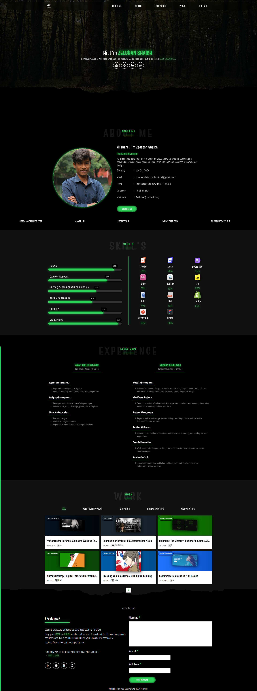
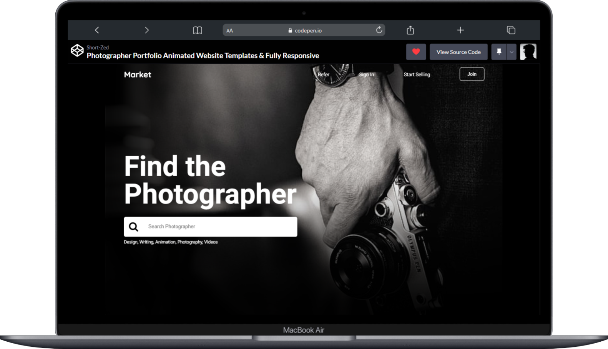
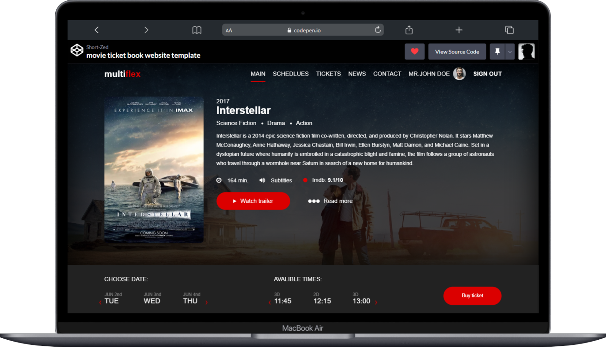
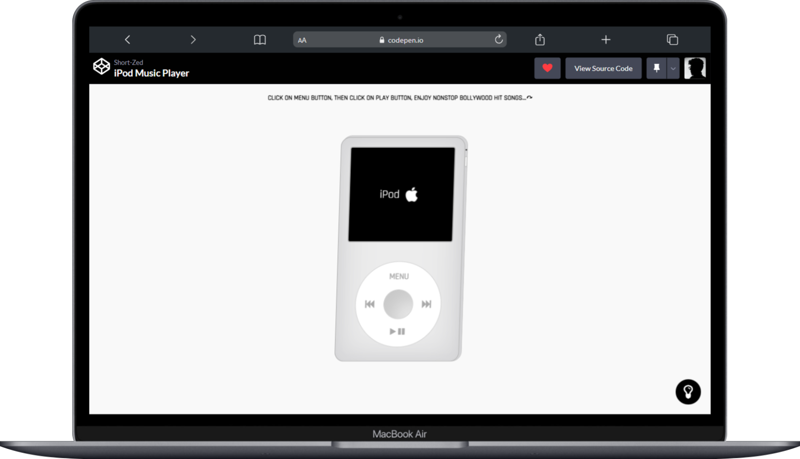
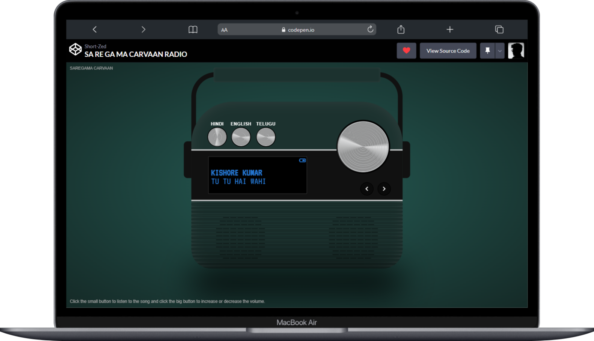
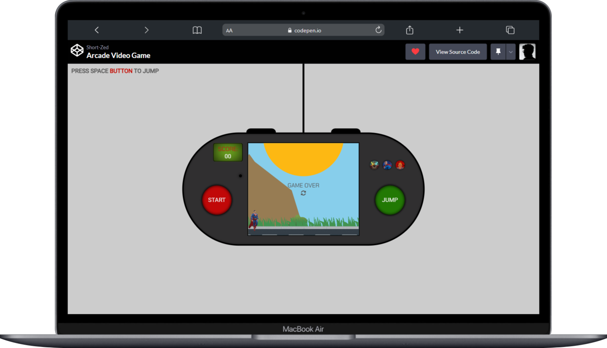

# Zeeshan Shaikh - Frontend Developer  

Hi there! I'm **Zeeshan Shaikh**, a passionate frontend developer with a knack for creating engaging websites and delightful user experiences. My expertise lies in crafting clean, efficient code and bringing designs to life with seamless animations and functionality.  

  

---

## About Me  

- **👨‍💻 Profession:** Frontend Developer  
- **📅 Birthday:** January 08, 2004  
- **📧 Email:** [zeeshan.shaikh.professional@gmail.com](mailto:zeeshan.shaikh.professional@gmail.com)  
- **📍 Location:** South Extension, New Delhi - 110003  
- **🌐 Languages:** Hindi, English  
- **🤝 Freelance:** Available ([Contact Me](mailto:zeeshan.shaikh.professional@gmail.com))  

  

---

## Skills  

### Frontend Development  
- **HTML5:** ⭐⭐⭐⭐⭐ (95%)  
- **CSS3:** ⭐⭐⭐⭐⭐ (98%)  
- **JavaScript:** ⭐⭐⭐⭐⭐ (90%)  
- **jQuery:** ⭐⭐⭐⭐ (70%)  
- **Bootstrap:** ⭐⭐⭐⭐ (75%)  
- **Sass:** ⭐⭐⭐⭐ (70%)  

### Backend Development  
- **PHP:** ⭐⭐⭐⭐ (75%)  
- **SQL:** ⭐⭐⭐⭐ (70%)  

### Platforms & Tools  
- **Shopify (Liquid):** ⭐⭐⭐⭐ (85%)  
- **WordPress:** ⭐⭐⭐⭐  
- **Git/GitHub:** ⭐⭐⭐⭐ (90%)  
- **Figma:** ⭐⭐⭐⭐ (80%)  
- **Canva, DaVinci Resolve, Krita, Adobe Photoshop**  

---

## Projects  

### 🌐 Web Development  
  

1. [Bergamot Beauté](https://bergamotbeauté.com)  
2. [Manzil](https://manzil.in)  
3. [Secretto](https://secretto.in)  
4. [MEDKLAIRE](https://medklaire.com)  
5. [Dress and Dazzle](https://dressanddazzle.in)  
6. [Pet Strong](https://petstrong.in)  
7. [Perform Group](https://performgroup.net)  
8. [Nutt Crunchers](https://nuttcrunchers.com)  
9. [Credible Art](https://credibleart.com)  

---

## Experience  

### Frontend Developer  
**Digital Valley Agency (2 Years)**  
- Designed and enhanced layouts to achieve usability and performance goals.  
- Built and maintained webpages using HTML, CSS, JavaScript, jQuery, and WordPress.  
- Collaborated with clients to translate designs into functional, visually appealing websites.  

### Shopify Developer  
**Bergamot Beauté (Current)**  
- Built and maintained the Bergamot Beauté website using Shopify Liquid, HTML, CSS, and JavaScript.  
- Regularly updated and managed product listings to ensure accuracy.  
- Worked closely with the design team for seamless integration of visual elements.  
- Managed version control using GitHub for efficient collaboration.  

---

## Portfolio Highlights  

### Web Development  

- **[Photographer Portfolio Animated Website](https://codepen.io/Short-Zed/full/ZEPNVWd)**  

    

- **[Movie Ticket Booking Website Template](https://codepen.io/Short-Zed/full/BaGzoQv)** 

    

- **[Custom iPod-Inspired Music Player with JavaScript](https://codepen.io/Short-Zed/full/JjeJQKv)** 

    

- **[Sa Re Ga Ma Carvaan Radio](https://codepen.io/Short-Zed/full/eYxOOLe)** 

   

- **[Arcade Video Game](https://codepen.io/Short-Zed/full/BaGQrMO)**
  
   

## Let's Collaborate!  

Looking for professional freelance services? Drop your email or phone number below, and I'll reach out to bring your project ideas to life.  

- Portfolio: [Zeeshan Shaikh Portfolio](https://short-zed.github.io/Portfolio.github.io/)  
- Email: [zeeshan.shaikh.professional@gmail.com](mailto:zeeshan.shaikh.professional@gmail.com)  

---

> **"The only way to do great work is to love what you do."** – Steve Jobs  

---

**© 2024 Zeeshan Shaikh. All rights reserved.**  

